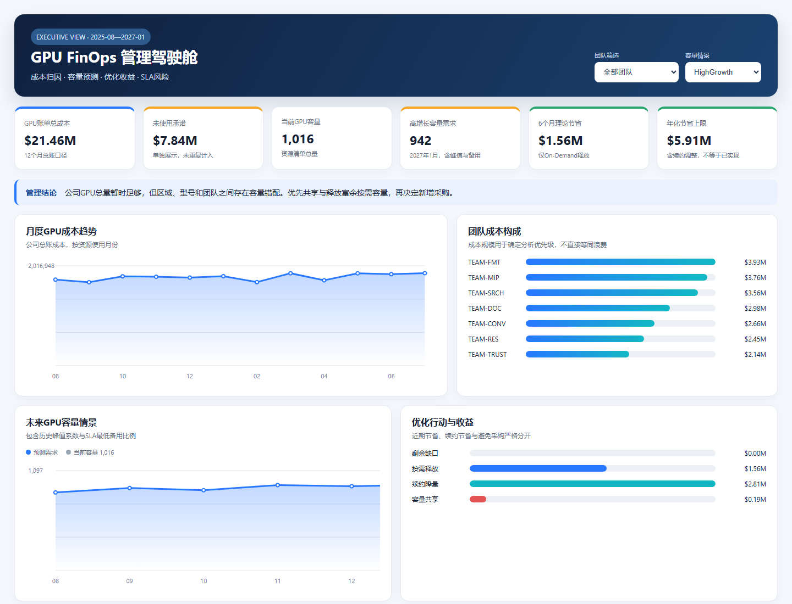

# AI Cloud Cost Optimization

一个面向云基础设施与FinOps岗位的端到端GPU成本优化作品集。项目基于一家虚拟B2B AI公司的12个月业务数据，从数据审计、成本归因和根因分析出发，完成业务预测、容量规划、优化测算和管理层交付。

🌐 **[在线打开GPU FinOps管理驾驶舱](https://tianyueni78-cyber.github.io/ai-cloud-cost-optimization-/)**



## 项目成果

| 指标 | 结果 |
|---|---:|
| 12个月GPU账单总成本 | $21.46M |
| 未使用承诺 | $7.84M |
| 当前GPU容量 | 1,016张 |
| 2027年1月高增长容量需求 | 942张 |
| 6个月理论节省 | $1.56M |
| 年化理论节省上限 | $5.91M |
| 容量共享避免采购成本 | $0.19M |

核心判断：公司GPU总量暂时足够，但区域、型号和团队之间存在容量错配。优先共享容量、释放富余On-Demand资源，并在续约时调整承诺采购；不能把低利用率直接等同于可回收资源。

## 快速查看

- [管理层摘要](reports/executive_summary.md)
- [交互式管理仪表盘](dashboard/index.html)
- [数据审计报告](reports/data_audit.md)
- [成本基线](reports/cost_baseline.md)
- [成本归因](reports/cost_attribution.md)
- [根因分析](reports/root_cause_analysis.md)
- [业务量与容量预测](reports/forecast_capacity.md)
- [优化方案](reports/optimization.md)
- [业务背景](docs/company_background.md) · [数据字典](docs/data_dictionary.md)

下载仓库后双击 `dashboard/index.html`，即可使用团队与容量情景筛选器查看仪表盘，不需要Power BI或外部图表服务。

## 业务问题

项目帮助云基础设施负责人在不破坏团队SLA、且必须支持未来业务增长的约束下，决定：

1. 如何调整On-Demand、Reserved和Savings Plan采购组合；
2. 哪些团队和GPU资源可以安全缩容或共享；
3. 未来6个月业务量和GPU容量需求是多少；
4. 优化行动可以产生多少节省，风险与实施顺序是什么。

分析范围为2025年8月至2026年7月的生产团队与GPU资源池；预测范围为2026年8月至2027年1月。

## 分析方法

```text
业务与指标定义
→ 数据审计与Pandas清洗
→ SQL成本基线与归因
→ 成本、业务量、单位成本和利用率根因分析
→ 滚动回测与六个月情景预测
→ 峰值系数和SLA备用容量换算
→ 采购、共享与缩扩容优化
→ 仪表盘和管理层摘要
```

关键方法：

- 保留原始CSV，只向 `outputs/` 写入清洗结果；
- 对完全重复和修订记录采用不同去重规则；
- 账单关联前后执行行数与金额对账；
- `requests`、`jobs`、`k_pages` 分开预测，避免混合业务单位；
- 在移动均值与线性趋势之间滚动回测选择模型；
- 容量需求包含历史峰值系数和SLA最低备用比例；
- 共享、按需释放和续约节省互斥计算，防止重复收益。

## 关键洞察

- FMT与RES训练单位成本分别上升约56%和57.25%，是优先优化对象。
- CONV推理成本增长90.46%，但请求量增长157.52%，单位成本下降26.04%，属于健康增长。
- 预计可释放71张富余On-Demand GPU，6个月理论节省$1.56M。
- 15张同区域、同型号、同负载容量可以进入共享验证，避免采购约$0.19M。
- 续约时有128张承诺容量调整候选，年化理论节省约$2.81M。
- 严格匹配区域和型号后仍有159张保守缺口，不能用公司总量余量掩盖局部短缺。

## 数据与技术

项目包含五张相互关联的合成数据表：小时级资源使用、云账单、资源清单、团队SLA和业务事件。数据覆盖A100、H100、L40S，多种采购方式以及训练、推理和批处理负载。

技术栈：

- DuckDB / SQL：数据盘点、审计、成本基线、归因与根因分析；
- Python / Pandas：数据清洗、预测、容量换算和优化测算；
- HTML / CSS / JavaScript：无外部依赖的交互式管理仪表盘；
- unittest：清洗、预测、优化和仪表盘指标规则验证；
- Git / GitHub：版本管理与作品集交付。

## 复现

在项目根目录创建并激活Python环境后运行：

```powershell
pip install pandas duckdb
python -m unittest discover -s tests -v
python src/clean_data.py
python src/forecast_capacity.py
python src/optimize_resources.py
python src/build_dashboard.py
```

生成结果位于本地 `outputs/`，该目录不上传GitHub。仪表盘数据写入 `dashboard/dashboard_data.js`，然后双击 `dashboard/index.html` 查看。

## 项目结构

```text
├── data/                 # 五张原始CSV与GitHub预览样本
├── docs/                 # 公司背景和数据字典
├── sql/portfolio/        # 审计、成本、归因和根因分析SQL
├── src/                  # 清洗、预测、优化和仪表盘数据程序
├── tests/                # 自动化规则测试
├── dashboard/            # 可打开的管理仪表盘、数据与截图
├── reports/              # 各阶段分析报告和管理层摘要
├── outputs/              # 本地生成结果，不提交Git
└── workbook.md           # 原始业务练习任务
```

## 数据说明

公司、团队、合同、业务事件和账单均为虚构或合成内容，仅用于学习和作品展示，不包含真实企业或客户信息。分析中的节省为理论毛收益，未扣除迁移、测试和实施成本，不代表实际财务承诺。

## License

[MIT License](LICENSE)
